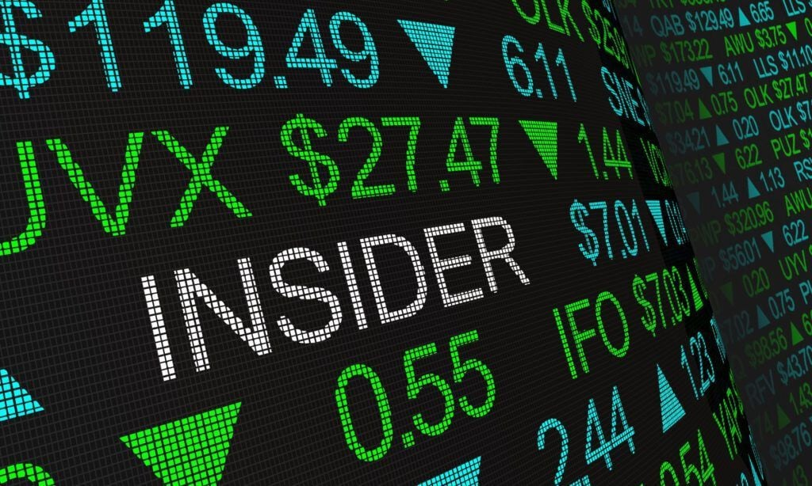

# Insider_Trading
Team project for insider trading

---
The Insider application checks the effect of insider trades on the top 10 AI companies closing price after 1 week of the filing date and compares the trend by using machine learning models.
It downloads 3 years of market daily closing from Yahoo Finance and the insider trade with SEC (Form 4) for the top 10 AI companies 

## Data inputs and cleaning 
Sources
* FinViz
* Yahoo Finance
* Sec.gov
## Data Cleansing
* Remove $,",", % ,#errors
* Changing the data types to datetime, float, integer
* Drop unnecessary columns and null vaules
* Applying Standard and other encoders

## Technologies
Multiple technologies and statistical models are used to build the insider Application
- Python
- Pandas, Numpy
- FinViz
- yfinance
- Google Collab
- Stremlit
- Sklearn
- Matplotlib
- Github

  ## Installation Guide

The user of the application will have to download Python,Python package manager PIP and Git.

   - [How to install Python](https://www.python.org/downloads/) 
   - [How to install PIP ](https://pip.pypa.io/en/stable/installation/) 
   - [How to install Git ](https://git-scm.com/book/en/v2/Getting-Started-Installing-Git) 

## Machine Learning Models Used

  ## Logistic Regression
 - Label Trend (0 - Stock price decreased, 1- Stock price increased)
  
 - Data Encoding / Splitting
* Tran, Test, Split
* Standard Scaler

## Support Vector Machine (SVM)
 - Trend (0 - Stock price decreased, 1- Stock price increased)
 -  Data Encoding / Splitting
* Time-sliced data (30 months of Training)
* Standard Scaler

## Long short-term memory (LSTM)
- Label Trend (0 - Stock price decreased, 1- Stock price increased)
 * Data Encoding / Splitting
 * Tran, Test, Split
 * Standard Scaler

## eXtreme Gradient Boosting (XGBoost)
- Label Trend (0 - Stock price decreased, 1- Stock price increased)
- Data Encoding / Splitting
* Tran, Test, Split
* Standard Scaler
  
## Analysis Report

* The purpose of the analysis is to examine how corporate insider trades change the trading environment.
* The individuals who engage in insider trading are typically corporate insiders, such as company executives and board members
* Corporate Insiders can only trade their Corporation's Securities during certain windows of time when there is no material non-public information that might affect a buyer or seller's trading decision.
* Insiders are generally contrarian investors and will sometimes purchase their own company’s stock following recent stock underperformance that they may feel is unjustified. 
* We found that Insider trades affect the closing price within 1 week after the filing date.
* comparing the 3 models the XGboost has outperformed the other evaluated models.
* Our findings reinforced the important role of insider trades in providing fundamental information and aiding price discovery

## Contributors

This application is developed by Luis, Joe, Mario, AlGhalia, Naf

---

## License

Copyright: N/A
