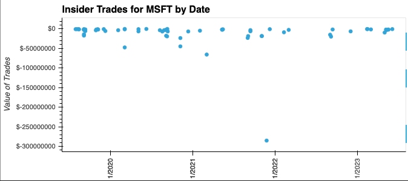
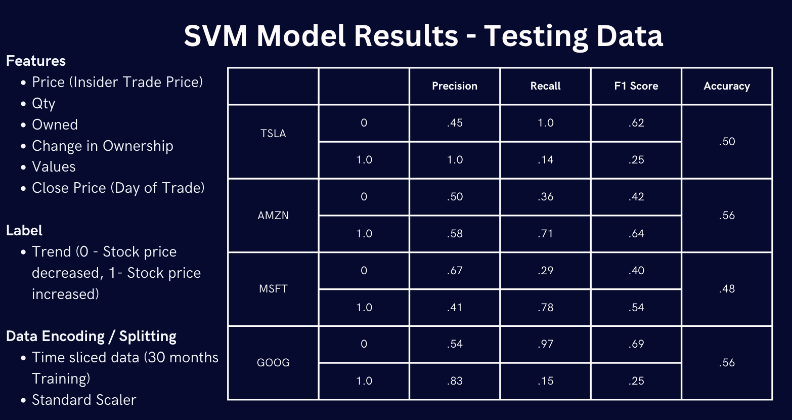

# Insider Trading Analysis -  Team 2 


---
The Insider application checks the effect of insider trades on the top 10 AI companies closing price after 1 week of the filing date and compares the trend by using machine learning models.
It downloads 3 years of market daily closing from Yahoo Finance and the insider trade with SEC (Form 4) for the top 10 AI companies.


**Insider Trades and the value for the last 3 years for MSFT**




**Insider Trades during the last 3 years for MSFT and stock closing price**


**Insider Trading - Price Impact After 1 week  - MSFT**


## Data inputs and cleaning 
Sources
* FinViz
* Yahoo Finance
* Sec.gov

## Technologies
Multiple technologies and statistical models are used to build the insider Application
- Python
- Pandas, Numpy
- FinViz
- yfinance
- Google Collab
- Stremlit
- Sklearn
- Matplotlib
- Github

## Installation Guide

The user of the application will have to download Python,Python package manager PIP and Git.

   - [How to install Python](https://www.python.org/downloads/) 
   - [How to install PIP ](https://pip.pypa.io/en/stable/installation/) 
   - [How to install Git ](https://git-scm.com/book/en/v2/Getting-Started-Installing-Git)
   - Streamlit : pip install streamlit

## Machine Learning Models Used

   - Logistic Regression
  
   - Support Vector Machine (SVM)
  
   - Long short-term memory (LSTM)
  
   - eXtreme Gradient Boosting (XGBoost)


## Machine Learning Models Outputs
### Logistic Regression


### Support Vector Machine (SVM)




### Long short-term memory (LSTM)


### Dependencies:

**Python 3.7**

```bash
pip install yfinance
pip install tensorflow
pip install xgboost
pip install streamlit

```

* To the run the app, do the following:

```bash
$ git clone https://github.com/devops4cloud/Insider_Trading.git
$ cd Insider_Trading
$ streamlit run report.py

```
* A new browser will show.

* Select the DataSet, select the Machine Learning algorithm and select the amount of samples.


### eXtreme Gradient Boosting (XGBoost)

**Streamlit was used to present the machine learning models**


## Analysis Report

* The purpose of the analysis is to examine how corporate insider trades change the trading environment.
* The individuals who engage in insider trading are typically corporate insiders, such as company executives and board members
* Corporate Insiders can only trade their Corporation's Securities during certain windows of time when there is no material non-public information that might affect a buyer or seller's trading decision.
* Insiders are generally contrarian investors and will sometimes purchase their own company’s stock following recent stock underperformance that they may feel is unjustified. 
* We found that Insider trades affect the closing price within 1 week after the filing date.
* comparing the 3 models the XGboost has outperformed the other evaluated models.
* Our findings reinforced the important role of insider trades in providing fundamental information and aiding price discovery

## Contributors

This application is developed by [Luis](https://github.com/lumiroga), [Joe](https://github.com/EthernetWink), (Mario)[https://github.com/devops4cloud],(AlGhalia)[https://github.com/alghalia], (Naf)[https://github.com/nafeezurc]

---

## License

Copyright: N/A
